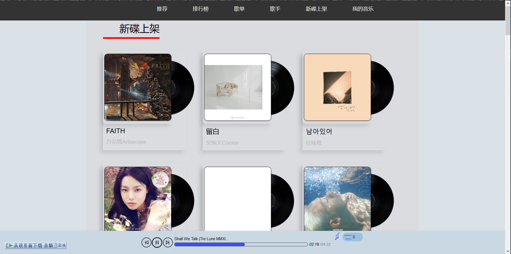

# netmusic

## 功能

1.  推荐

    

2.  排行榜

    

3.  歌单

    

4.  歌手

    - 歌手分类

      

    - 歌手 MV

      

    - 歌手热歌

      

    - 歌手热歌

      

5.  新碟上架

    
    

## 安装

```
$ git clone git@github.com:Binaryify/NeteaseCloudMusicApi.git
$ npm install

$ git clone https://github.com/mr-houyw/NetMusic.git
$ npm install
```

## 运行

```
$ cd NeteaseCloudMusicApi
$ node app

$ cd NetMusic
$ npm run serve
```

## API 接口

[Binaryify/NeteaseCloudMusicApi](https://github.com/Binaryify/NeteaseCloudMusicApi)
